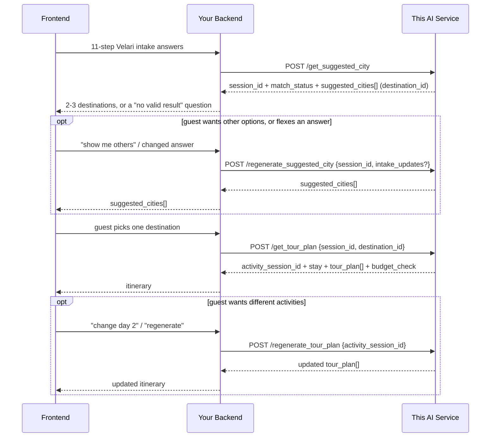

# Backend Integration Guide: Two-Step Trip Flow

This is the end-to-end guide for whoever wires the frontend to this service
through your backend (Frontend → your Backend → this AI service → your
Backend → Frontend). The field-by-field Step 1 contract is in `API_CITY_FLOW_DOCS.md`.

## 1. The flow, in one picture



## 2. Step 1: get destination suggestions

```
POST /get_suggested_city
```

Send the intake answers using the form keys and option codes (see
`API_CITY_FLOW_DOCS.md` §2). Store the returned `session_id`; every later
call is keyed off it.

Branch on `match_status`:

| `match_status` | Meaning | What to show |
|---|---|---|
| `matched` | 2–3 candidate destinations | Each card: `match_reasons`, `tradeoffs`, `unresolved_facts` |
| `no_valid_result` | Hard constraints rule out every destination | `response.no_valid_result.blocking_constraints[].explanation` and `question`, then let the guest change an answer |

Also ask any `response.clarifications` as optional follow-ups.

To show other options, call `POST /regenerate_suggested_city` with the same
`session_id`. Destinations already shown are never repeated.

To apply a changed answer, add `intake_updates`, e.g.
`{"travel_distance": "anywhere"}`. The answers are re-validated and re-ranked
from scratch.

## 3. Step 2: get the itinerary for the chosen destination

```
POST /get_tour_plan
```

```json
{
  "session_id": "5f3c0c1e-...",
  "destination_id": "PT-AZO"
}
```

- **Always send `destination_id`.** `selected_city` (the destination's exact
  name) still works as a fallback.
- **Only destinations suggested in this session are accepted.** Anything else
  returns `400`: it was never matched against the guest's answers, or a
  must-avoid restriction excluded it.
- **Backlog or unknown IDs return `404`.**

The response keeps its previous shape, with these additions:

- **`destination_id`.**
- **`budget_check`:** the estimated nightly cost of the stay, compared with
  the guest's per-room nightly budget.
  - If no stay in the map search fits the budget, `stay_within_budget` is
    `false`. The budget is never changed silently.
  - All numbers are `ESTIMATED`.
- **On `stay`:** `price_status: "ESTIMATED"` and `availability_status: "NOT_CHECKED"`.
  The stay comes from a Google Places search. Places has no bookable rates,
  so confirm the final payable amount with the booking provider before booking.
- **On each activity:**
  - `place_id` and `business_status`, from Google Places. Permanently or
    temporarily closed places are dropped.
  - `availability_note`, reminding the guest that opening hours do not
    confirm tickets or availability.

`total_cost_estimate` is calculated as:

- stay estimate × nights × rooms, plus
- activity estimates × party size.

A second `/get_tour_plan` call for the same destination returns the cached
plan (`"source": "cached"`).

`POST /regenerate_tour_plan` is unchanged:
`{ "activity_session_id": ..., "day_to_regenerate": <int|null>, "user_instruction": "..." }`.

## 4. Sessions

`session_id` and `activity_session_id` are the only handles you pass around.
`GET /session/{session_id}` returns:

- `intake`: the validated answers;
- `suggested_cities` and `shown_destination_ids`;
- `regeneration_history`.

**Caveat:** sessions live in this service's process memory. They do not
survive a restart and are not shared across worker processes. Move them to a
durable store before running more than one worker.

## 5. Error handling

| Status | When | What to do |
|---|---|---|
| `422` | Body doesn't match the intake schema (unknown code, too many selections, missing severity, bad dates, old 15-question payload), or invalid `intake_updates` | Show the field-level `detail`; don't retry the same body. |
| `400` (`/get_tour_plan`) | Destination not suggested in this session | Offer only the destinations returned in Step 1. |
| `404` | Unknown session/activity session/destination; or `/regenerate_suggested_city` has no more destinations for these answers | Start a new Step 1 call, or send `intake_updates`. |
| `500` | Upstream tool/LLM failure | Safe to retry; matching itself is deterministic. |

## 6. Quick reference

| Endpoint | Changed? | Purpose |
|---|---|---|
| `POST /get_suggested_city` | **Yes: new request body and response fields** | Step 1: Velari intake → 2–3 catalog destinations |
| `POST /regenerate_suggested_city` | **Yes: `intake_updates`** | Next options, or re-rank refined answers |
| `POST /get_tour_plan` | **Yes: `destination_id` replaces `property_id`** | Step 2: destination → day-by-day plan |
| `POST /regenerate_tour_plan` | No | Step 2 regenerate |
| `GET /session/{id}` | **Yes: returns `intake`** | Stored session details |
| `GET /activity_session/{id}` | Adds `destination_id` | Stored itinerary details |
| `DELETE /session/{id}`, `DELETE /activity_session/{id}` | No | Delete a session |
| `POST /v2/retreat-recommendations` | **Removed** | Belonged to the old 15-question questionnaire |
