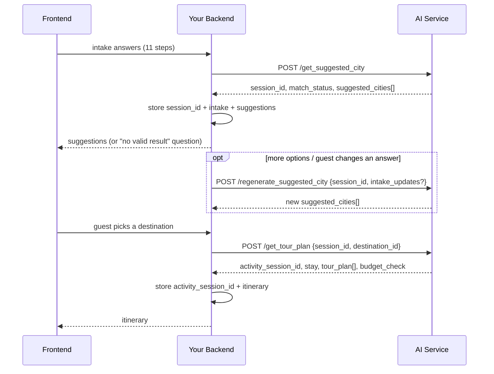

# API Changes: Velari Intake and Destination Matching

**For:** the backend team that calls this AI service, stores the results and
returns them to the frontend.
**Effective:** 2026-09-28. **This is a breaking change.**

---

## 1. Summary

| What | Before | Now |
|---|---|---|
| Questionnaire | 15 questions (archetype, spirituality, transform focus...) | **11-step Velari intake** (feelings, trip goals, moments, setting, pace, party, restrictions, departure, timing, budget) |
| Where suggestions come from | 150 retreat properties (`Retreat Master Database.xlsx`) | **72 candidate destinations** (`data/1. AI_IMPORT_DESTINATIONS.csv`) |
| Suggestion ID | `property_id` (e.g. `retreat_118`) | **`destination_id`** (e.g. `PT-AZO`, `NE-1159151609`) |
| Number of suggestions | Up to 5 | **2–3**, all from different countries |
| When nothing fits | Error or empty list | **`200` with `match_status: "no_valid_result"`**, the blocking reason, and a question for the guest |
| Budget | Per person, per night | **USD per room, per night** |
| `POST /v2/retreat-recommendations` | Existed | **Removed** |

Old 15-question payloads now fail with `422`.

---

## 2. Endpoints

| Endpoint | Status | Purpose |
|---|---|---|
| `POST /get_suggested_city` | **Changed request and response** | Intake answers → 2–3 destinations |
| `POST /regenerate_suggested_city` | **Changed (new `intake_updates`)** | More options, or re-rank after the guest changes an answer |
| `POST /get_tour_plan` | **Changed (`destination_id` replaces `property_id`)** | Chosen destination → day-by-day itinerary |
| `POST /regenerate_tour_plan` | Unchanged request; response adds fields | Regenerate all days or one day |
| `GET /session/{session_id}` | **Changed (`intake` replaces `questions_answers`)** | Stored suggestion session |
| `GET /activity_session/{activity_session_id}` | Adds `destination_id` | Stored itinerary session |
| `DELETE /session/{session_id}` | Unchanged | Deletes the session and its itineraries |
| `DELETE /activity_session/{activity_session_id}` | Unchanged | Deletes one itinerary |
| `POST /v2/retreat-recommendations` | **Removed** | — |

---

## 3. Flow



---

## 4. `POST /get_suggested_city`: request

Field names are the intake form's `key` values. **Send option codes, not the
labels shown on screen.** The form definition is in
`app/schemas/velari_intake_form.json`.

### Example

```json
{
  "recent_feelings": ["stretched_thin"],
  "recent_feelings_other": null,
  "trip_goals": ["restoration", "reflection"],
  "trip_prompt": "need_a_break",
  "trip_prompt_other": null,
  "preferred_moments": ["quiet_privacy", "spa_wellness", "nature_wildlife"],
  "preferred_environments": ["coast", "mountains"],
  "trip_pace": "one_highlight",
  "travel_party": "couple",
  "party_adults": 2,
  "party_children": 0,
  "party_rooms": 1,
  "activity_restrictions": ["no_long_drives", "avoid_extreme_heat"],
  "restriction_severity_no_long_drives": "prefer_avoid",
  "restriction_severity_avoid_extreme_heat": "must_avoid",
  "restriction_notes": null,
  "departure_location": "Lisbon",
  "travel_distance": "manageable_flight",
  "travel_timing": "exact_dates",
  "check_in_date": "2026-12-12",
  "check_out_date": "2026-12-17",
  "trip_nights": 5,
  "budget_per_night": 400
}
```

### Fields

| Step | Field | Type | Required | Allowed values / rules |
|---|---|---|---|---|
| 1 | `recent_feelings` | string[] | Yes, 1–2 | `stretched_thin`, `stuck_in_routine`, `disconnected`, `curious`, `energized`, `turning_point`, `content_ready`, `something_else` |
| 1 | `recent_feelings_other` | string ≤500 | When `something_else` is chosen | Free text. **Private** (see §10) |
| 2 | `trip_goals` | string[] | Yes, 1–2 | `restoration`, `connection`, `discovery`, `adventure`, `inspiration`, `celebration`, `reflection`, `growth` |
| 3 | `trip_prompt` | string | Yes | `need_a_break`, `time_with_someone`, `celebrating`, `curious_to_explore`, `ready_for_change`, `change_of_scenery`, `no_particular_reason`, `something_else` |
| 3 | `trip_prompt_other` | string ≤500 | When `something_else` | Free text. **Private** (see §10) |
| 4 | `preferred_moments` | string[] | Yes, 1–3 | `food_drinks`, `art_history_culture`, `nature_wildlife`, `beaches_water`, `movement_adventure`, `quiet_privacy`, `meeting_people`, `spa_wellness`, `music_nightlife`, `learning_making` |
| 5 | `preferred_environments` | string[] | Yes, 1–2 | `coast`, `mountains`, `forest_jungle`, `desert`, `countryside`, `small_town`, `vibrant_city`, `surprise_me` (`surprise_me` must be the only choice) |
| 6 | `trip_pace` | string | Yes | `mostly_open`, `one_highlight`, `balanced`, `full_days` |
| 7 | `travel_party` | string | Yes | `solo`, `couple`, `group`, `family` |
| 7 | `party_adults` | int 1–30 | No | Default: `solo` 1, `couple` 2, others 1. `solo` must be 1. |
| 7 | `party_children` | int 0–20 | No | Default 0. `solo` must be 0. |
| 7 | `party_rooms` | int 1–20 | No | Default 1. Cannot exceed adults + children. |
| 7 | `party_child_ages` | int[] (0–17) | No (not on the form yet) | One age per child. Needed later for live room rates. |
| 8 | `activity_restrictions` | string[] | No | `mobility_accessibility`, `food_dietary`, `no_long_drives`, `no_intense_activity`, `no_water_activities`, `avoid_extreme_heat`, `avoid_cold_weather`, `other` |
| 8 | `restriction_severity_<option>` | string | For **each** selected restriction | `must_avoid` or `prefer_avoid` |
| 8 | `restriction_notes` | string ≤1000 | No | "Other planning needs" free text |
| 9 | `departure_location` | string ≤200 | Yes | City or airport text |
| 9 | `departure_latitude`, `departure_longitude` | float | No (send both or neither) | From a places-autocomplete widget. Skips server geocoding. |
| 9 | `departure_country` | string | No | Country name from the same widget |
| 9 | `travel_distance` | string | Yes | `nearby`, `manageable_flight`, `anywhere` |
| 10 | `travel_timing` | string | Yes | `exact_dates`, `flexible`, `month_season` |
| 10 | `check_in_date`, `check_out_date` | `YYYY-MM-DD` | When `exact_dates` | Check-out after check-in; check-in not in the past |
| 10 | `travel_period` | string | When `month_season` | `spring`, `summer`, `autumn`, `winter`, `january` … `december` |
| 10 | `trip_nights` | int 1–90 | Yes | With exact dates it may be omitted (it is derived); if sent, it must match the dates |
| 11 | `budget_per_night` | number 100–7000 | Yes | **USD per room, per night.** `7000` = "$7,000+" (no upper limit). |
| — | `currency` | string | No | Only `"USD"` |

**Notes**
- **Severity format:** restriction severity may instead be sent as one object,
  `"restriction_severity": {"no_long_drives": "prefer_avoid"}`.
- **Hidden fields are dropped, not rejected.** This covers
  `recent_feelings_other` without `something_else`, dates without
  `exact_dates`, and `travel_period` without `month_season`.
- **Unknown fields are rejected with `422`.**

---

## 5. `POST /get_suggested_city`: response

### Top level

| Field | Type | Notes |
|---|---|---|
| `session_id` | string | **Store it.** Every later call uses it. |
| `match_status` | string | `matched` or `no_valid_result` |
| `suggested_cities` | array | 2–3 items when `matched`; empty when `no_valid_result` |
| `response` | object | Details and audit data (below) |

### Each item in `suggested_cities`

| Field | Type | Show to guest? | Notes |
|---|---|---|---|
| `destination_id` | string | No (keep it for the next call) | **Send this to `/get_tour_plan`** |
| `city_name` | string | Yes | Destination name, e.g. "São Miguel, Azores" |
| `country_name` | string | Yes | |
| `world_region` | string | Optional | |
| `number_of_days` | int | Yes | Equals `trip_nights` |
| `description` | string | Yes | Short summary (first 2 reasons) |
| `city_image` | string[] | Yes | May be empty |
| `latitude`, `longitude` | float \| null | Map pin | May be null |
| `match_score` | int 0–100 | Optional | Do not recalculate it in the frontend |
| `score_breakdown` | object | No (audit) | Points per part of the score, plus the prefer-avoid penalty |
| `match_reasons` | string[] | **Yes** | Tied to the guest's own answers |
| `tradeoffs` | string[] | **Yes, visible** | Don't hide them |
| `unresolved_facts` | string[] | **Yes, visible** | What has not been checked yet (price, availability, route, entry and safety) |
| `warnings` | string[] | — | Same as `tradeoffs`; kept for older clients |
| `restriction_checks` | object[] | Optional | One per restriction: `restriction`, `label`, `severity`, `status`, `detail` |
| `distance_check` | object | Optional | `status`, `straight_line_km`, `detail`, `route_status` (always `UNVERIFIED`) |
| `verification` | object | Show status | `candidate_status`, `source_review_status`, `live_lodging_status`, `verified_nightly_usd` (null = unknown, **not 0**), `budget_status` (`UNKNOWN` today), `price_claim` and `availability_claim` (`NONE`) |
| `evidence` | object | No (store for audit) | Source URL, source scope, last-checked date, map lookup outcome and timestamp |

`restriction_checks[].status` is one of `no_catalog_concern`,
`seasonal_outside_dates`, `unverified` or `itinerary_stage`. `conflict` never
appears for a must-avoid restriction, because those destinations are
excluded; it can appear for a prefer-avoid one.

### `response` object

| Field | Notes |
|---|---|
| `match_status`, `suggested_cities` | Same as the top level |
| `no_valid_result` | `null`, or `{blocking_constraints[], question, relaxed_automatically: false}` (see §6) |
| `clarifications` | Optional follow-up questions: `{field, blocking, question}`. Show them to the guest. |
| `guest_context` | The guest's answers as labels (and each trip goal's definition) to reflect back in the UI |
| `eligible_count`, `excluded_count`, `excluded_by_reason`, `total_candidate_count` | Counts for audit and debugging |
| `data_gaps` | Known limits of the data, e.g. "no verified prices yet" |
| `origin` | Departure lookup: `status` (`GEOCODED`, `GUEST_SUPPLIED`, `UNVERIFIED`, `NOT_NEEDED`), coordinates, `checked_at_utc` |
| `estimate_status`, `generated_at_utc` | Freshness |
| `intake_form`, `catalog_version`, `intake_mapping_version`, `scoring_version` | **Store them** so you know which rules produced a result |

---

## 6. When nothing fits (`match_status: "no_valid_result"`)

This is **not an error**: the HTTP status is still `200`. It happens when the
guest's firm answers rule out every destination.

```json
"no_valid_result": {
  "blocking_constraints": [
    {
      "constraint": "unverified_high_impact:mobility_accessibility",
      "field": "restriction_severity_mobility_accessibility",
      "excluded_count": 67,
      "explanation": "'Mobility or accessibility' is marked as something you must plan around, and 67 destinations have no verified information about it yet. We won't treat unknown as suitable."
    }
  ],
  "question": "Could you tell us more about what you need ...?",
  "relaxed_automatically": false
}
```

**What to do:**
1. Pass `explanation` and `question` to the frontend.
2. Let the guest change an answer. `field` names the answer to change.
3. Call `/regenerate_suggested_city` with `intake_updates` (§7).

**Known case:** "Mobility or accessibility" marked **must avoid** always
leads here today, because no destination has verified accessibility data yet.
"Prefer to avoid" returns options.

---

## 7. `POST /regenerate_suggested_city`

```json
{
  "session_id": "5f3c...",
  "user_instruction": "optional note",
  "intake_updates": { "restriction_severity_mobility_accessibility": "prefer_avoid" }
}
```

| Case | Behavior |
|---|---|
| No `intake_updates` | Same answers. Returns the next 2–3 destinations and **never repeats** one already shown. When none are left, returns `404`. |
| With `intake_updates` | Merges the changed fields into the stored answers, re-validates them (`422` if invalid; the session is left unchanged) and ranks from scratch. The shown list resets. |

The response has the same shape as §5. After an `intake_updates` call,
**update your stored copy of the intake**, or read it back from
`GET /session/{session_id}`.

---

## 8. `POST /get_tour_plan`

### Request

```json
{ "session_id": "5f3c...", "destination_id": "PT-AZO" }
```

- **Always send `destination_id`.** `selected_city` (the exact destination
  name) still works as a fallback.
- **The destination must be one suggested in this session.** Otherwise:
  - a destination not suggested in this session returns `400`;
  - an unknown or backlog ID returns `404`.
- **`property_id` is no longer accepted.**

### Response

| Field | Notes |
|---|---|
| `activity_session_id` | **Store it** |
| `destination_id` | New |
| `city` | Destination name |
| `stay` | The stay (see below) |
| `tour_plan` | `[{day, activities[]}]` |
| `total_cost_estimate` | Stay estimate × nights × rooms, plus activity estimates × party size. **An estimate.** |
| `budget_check` | New (see below) |
| `packing_tips`, `travel_tips` | Text |
| `source` | `generated`, `cached` (same destination requested again) or `regenerated` |

**`stay`** fields:

- unchanged: `name`, `address`, `rating`, `price_level`, `photos`, `coords`,
  `average_nightly_price`, `budget_tier`, `facilities`, `website`, `estimate_note`;
- **new** `price_status: "ESTIMATED"` and `availability_status: "NOT_CHECKED"`.

The stay comes from a map search, **not from a booking system**. It is not a
confirmed price or room.

**`budget_check`** (new):

```json
{
  "budget_per_night_usd": 400,
  "budget_open_ended": false,
  "rooms": 1,
  "estimated_stay_nightly_usd": 225,
  "stay_within_budget": true,
  "status": "ESTIMATED",
  "note": "Estimated from map data, not a live rate. Confirm the final payable amount ..."
}
```

If `stay_within_budget` is `false`, show it. The guest's budget is never
changed silently.

**Each activity** has these fields:

- unchanged: `activity_name`, `activity_description`, `activity_location`,
  `activity_address`, `activity_image`, `activity_time`, `activity_cost`,
  `distance_from_previous_km`;
- **new:**
  - `place_id` (Google place ID, or null);
  - `business_status` (e.g. `OPERATIONAL`); permanently or temporarily closed
    places are removed;
  - `availability_note`: opening hours do not confirm tickets, so the guest
    must confirm with the operator. **Show it.**

`POST /regenerate_tour_plan` takes the same request as before
(`activity_session_id`, `day_to_regenerate`, `user_instruction`). Its
response adds `destination_id` and `budget_check`.

---

## 9. What to store on your side

**This AI service keeps sessions in memory only.** They are lost when the
service restarts or redeploys, and are not shared between workers. Treat your
database as the source of truth.

| Store | Why |
|---|---|
| `session_id` | Needed for regenerate and tour-plan calls |
| The intake you sent (and later `intake_updates`) | To resubmit if the AI session is lost, and to show the guest their answers |
| `match_status` + `suggested_cities` (full objects) | To redisplay without calling again, and for audit |
| `response.catalog_version`, `intake_mapping_version`, `scoring_version`, `generated_at_utc` | To know which data and rules produced a result |
| Each item's `evidence` and `verification` | Audit trail |
| The chosen `destination_id` | Links the guest's choice to the itinerary |
| `activity_session_id` + the tour-plan response | The itinerary shown to the guest |

**If a call returns `404` for a session you have stored**, the AI service
probably restarted. Call `/get_suggested_city` again with the stored intake.
Destination IDs are stable for the same catalog snapshot.

**Suggested tables** (adjust to your schema):

- `trip_intake(id, user_id, intake_json, created_at)`
- `trip_suggestion_session(id, intake_id, ai_session_id, match_status, response_json, catalog_version, scoring_version, generated_at)`
- `trip_itinerary(id, suggestion_session_id, destination_id, ai_activity_session_id, response_json, created_at, updated_at)`

---

## 10. Privacy: required handling

`recent_feelings_other` and `trip_prompt_other` can contain private emotional
text written by the guest. The AI service:

- never uses this text for matching;
- never puts it in AI prompts or map/travel lookups;
- never returns it in suggestion responses.

**On your side:**
- **Don't log these two fields** (request logs, error trackers, analytics).
- **Store them only with the rest of the intake**, with restricted access.
- **Never forward them to third-party services.**

`GET /session/{session_id}` does return them (the stored intake), so treat
that response the same way.

---

## 11. Errors

| Status | When | What to do |
|---|---|---|
| `200` + `no_valid_result` | No destination fits the firm answers | Show the question and let the guest change an answer (§6) |
| `422` | Body doesn't match the intake (unknown code, too many selections, missing severity, bad dates, old 15-question body, unknown field) or invalid `intake_updates` | Map `detail[].loc` to form fields and show `detail[].msg`. Don't retry the same body. |
| `400` | `/get_tour_plan` with a destination not suggested in this session | Only offer destinations from the latest suggestions |
| `404` | Unknown or expired session; unknown `destination_id`; no more options on regenerate | Resubmit the stored intake, or send `intake_updates` |
| `500` | Map or AI provider failure | Safe to retry |

---

## 12. Migration checklist

- [ ] Replace the 15-question payload with the 11-step intake (§4). Send codes, not labels.
- [ ] Send one `restriction_severity_<option>` for each selected restriction.
- [ ] Treat `budget_per_night` as **per room**, not per person.
- [ ] Rename `property_id` → `destination_id` in storage and in the `/get_tour_plan` call.
- [ ] Handle `match_status: "no_valid_result"` as a normal response (§6).
- [ ] Support `intake_updates` on regenerate so the guest can change an answer.
- [ ] Forward `match_reasons`, `tradeoffs`, `unresolved_facts`, `clarifications` and `budget_check` to the frontend.
- [ ] Read `intake` (not `questions_answers`) from `GET /session/{id}`.
- [ ] Stop calling `POST /v2/retreat-recommendations`.
- [ ] Persist sessions, intake and results in your own database (§9).
- [ ] Exclude `recent_feelings_other` and `trip_prompt_other` from all logs (§10).
- [ ] (Optional) Send `departure_latitude`, `departure_longitude` and `departure_country` from autocomplete, and `party_child_ages` when collected.
